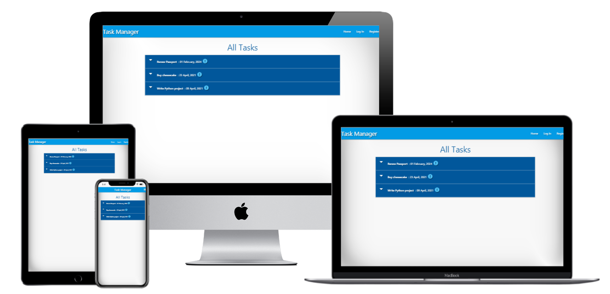

# Task manager project
***

## Code Institute mini project 

[link](https://flask-task-matea-project.herokuapp.com/) of the project

## Technologies Used

The following technologies have been used in this project:

* [Python 3.8.2](https://www.python.org/download/releases/3.0/) 
    * Python is supposed to be the main hero of this project.
* [Flask](https://flask.palletsprojects.com/en/1.1.x/)
    * web framework written in Python.
* [Jinja](https://jinja.palletsprojects.com/en/2.11.x/)
    * is used as templating language for Python and its depending framework Flask
* [MongoDB](https://www.mongodb.com/)
    * It is a document-oriented database program.
* [Heroku](https://heroku.com/)
    * It is a cloud platform to run this python project.
* [HTML](https://www.w3.org/TR/html52/) 
    * used to structure and presenting the content.
* [CSS](https://www.w3.org/Style/CSS/Overview.en.html)
    * used for styling.
* [JQuery](https://jquery.com/)
    * this project used JavaScript in the form of JQuery to simplify DOM manipulation.
* [Materialize 1.0.0](https://materializecss.com/)
    * CSS framework used for structuring and presenting the content.
* [FontAwesome](https://fontawesome.com/)
    * used to create icons.